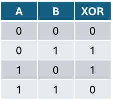
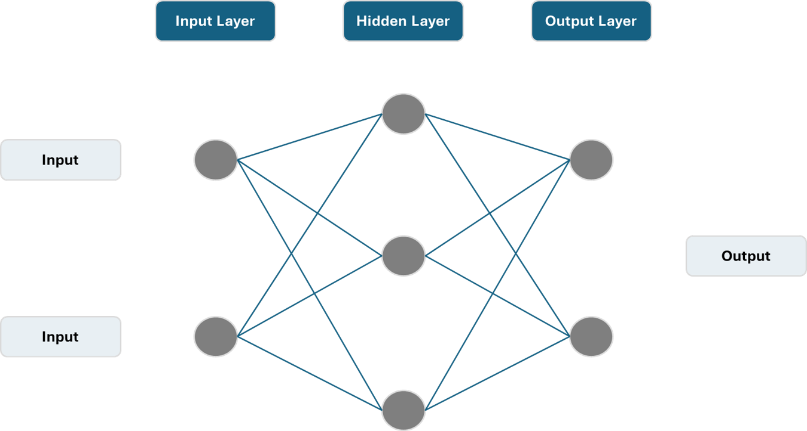
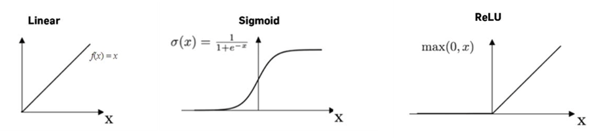
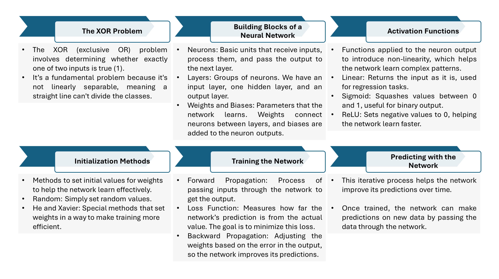

# Simple Neural Network Implementation using NumPy
A simple Python implementation of a neural network to solve the XOR problem using various initialization techniques and activation functions.

## Overview
A straightforward Python implementation of a neural network to solve the XOR problem using NumPy. This network is trained via backpropagation and supports various initialization methods (Random, He, Xavier) and activation functions (Linear, Sigmoid, ReLU).

## The Process

### 1. The XOR Problem
The XOR (exclusive OR) problem involves predicting an output based on two binary inputs. For instance, given two switches, XOR determines whether the light should be on or off based on the positions of the switches. This problem is useful for demonstrating neural networks because it cannot be solved with a simple linear model, highlighting the need for more complex structures.

  

### 2. Building Blocks of a Neural Network
Neural networks consist of layers of interconnected nodes or neurons. Each layer processes information and passes it to the next. The network includes:

- Input Layer: Receives the initial data.
- Hidden Layers: Perform computations and learn patterns. Neurons in these layers are connected by parameters called weights and biases:
- Biases: These are additional parameters added to the weighted sum of inputs. They allow the model to fit the data better by shifting the activation function.
- Output Layer: Provides the final prediction or decision based on the processed information from the hidden layers.

Neurons are the fundamental units that take input, apply a weighted sum, and use an activation function to produce an output. Parameters, specifically weights and biases, are adjusted during training to improve the network's accuracy.

Weights are values that determine the importance of each input feature. They are multiplied with the input values and adjusted during training to improve the network's accuracy. Biases are additional parameters added to the weighted sum of inputs. They allow the model to fit the data better by shifting the activation function.

These layers and their neurons work together to transform input data into meaningful results.

  

### 3. Activation Functions
Activation functions introduce non-linearity into the network, allowing it to learn complex patterns:
- Linear Activation: Directly passes input values through.
- Sigmoid Activation: Compresses outputs to a range between 0 and 1, ideal for binary classification.
- ReLU Activation: Outputs the input if positive; otherwise, zero. It helps the network learn faster and model complex patterns.

  

### 4. Weight Initialization Methods
Initialization methods set the starting values for the network's weights, which affects how well the network learns:
- Random Initialization: Assigns random values to weights.
- He Initialization: Optimized for ReLU activation functions, improving learning efficiency.
- Xavier Initialization: Balances variance in activations, useful for sigmoid and tanh functions.

Proper initialization helps the network train more effectively and converge faster.

### 5. Training the Network
Training involves teaching the network to make accurate predictions by adjusting its weights based on errors:
- Forward Propagation: Calculates outputs by passing inputs through the network.
- Loss Calculation: Measures the difference between predicted and actual values.
- Backpropagation: Adjusts weights to minimize errors by computing gradients, , which indicate how to change weights to minimize the loss.

### 6. Predicting with the Network
This iterative process helps the network improve its predictions over time.

After training, the neural network can make predictions on new data. By inputting new values, the network uses its learned parameters to provide outputs. This step demonstrates the practical application of the network's learning and its ability to generalize from training data.

  

## License:
This project is licensed under the Raza Mehar License. See the LICENSE.md file for details.

## Contact:
For any questions or clarifications, please contact Raza Mehar at [raza.mehar@gmail.com].
